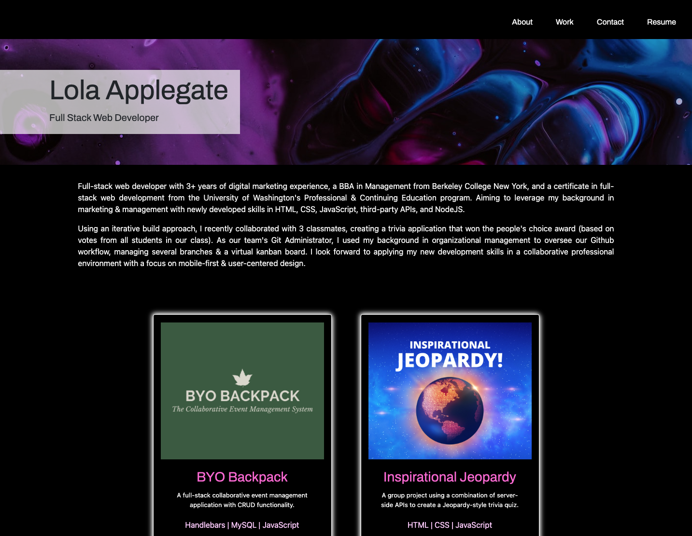
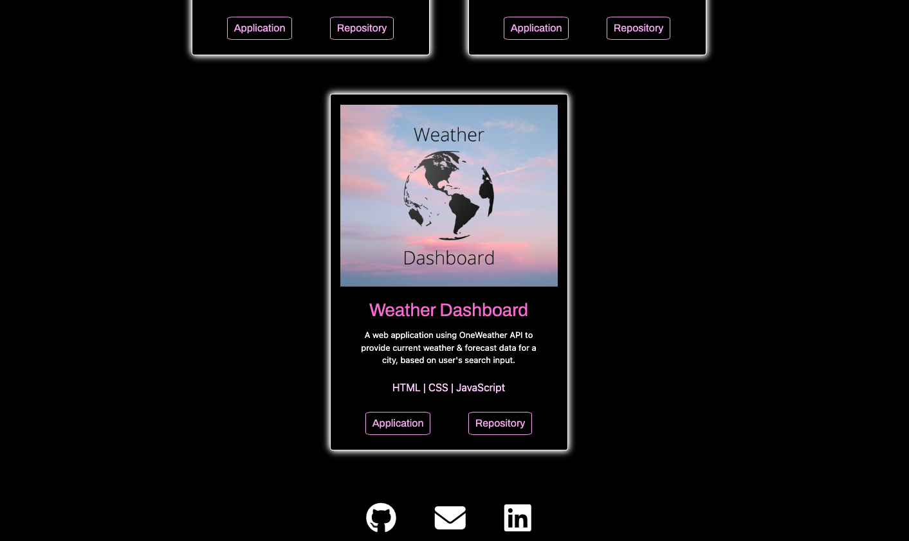

# Updated Professional Portfolio

## Description
An online professional portfolio containing my brand statement, some of the work I've completed, and my contact information. 

---

## Table of Contents
* [Deployed Application](#deployed-application)
* [Usage](#usage)
* [Questions](#questions)

---

## Deployed Application
[Professional_Portfolio](https://lola-violet.github.io/updated-portfolio/)

---

## Usage
The navbar contains links to each part of the page. Each project card contains a link to the deployed application & the github repository associated with that project. My contact information is contained in the footer, where links can be accessed by clicking on the icons. 

---

---

## Questions
View all of my projects on [GitHub](https://github.com/lola-violet).

If you have any questions or want to contribute, please contact me via email at [lolaviolet.dev@gmail.com](mailto:lolaviolet.dev@gmail.com).